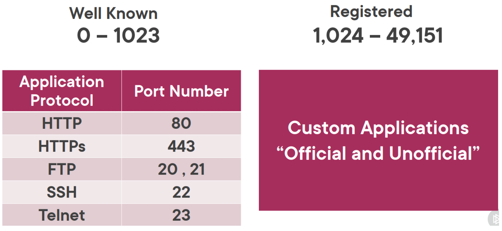
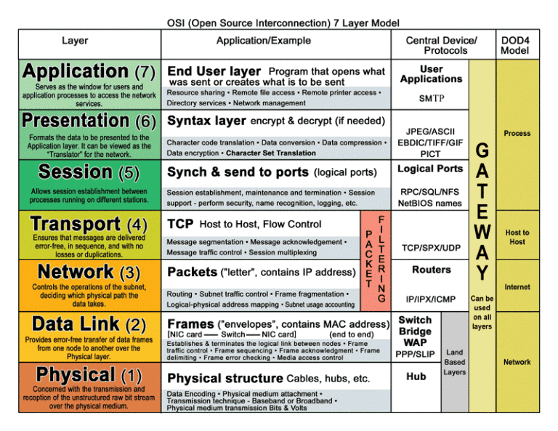
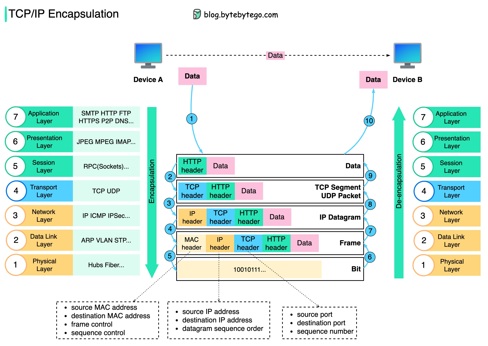
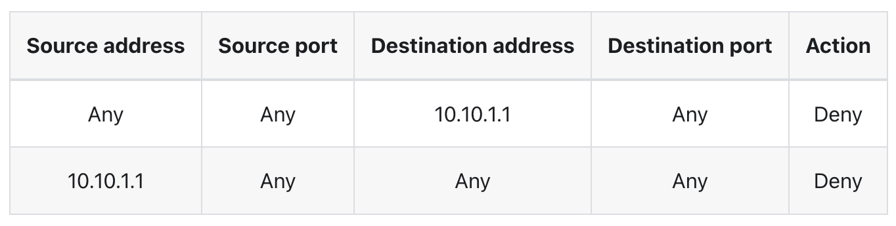
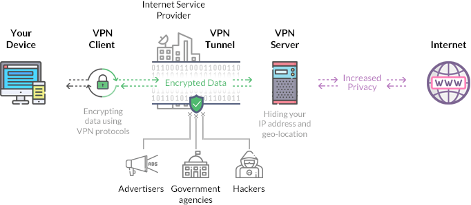

# Networking Concepts

## Concepts
- MAC address
- IP, Network/Subnetwork, mask, gateway, ports
- OSI model, encapsulation & decapsulation
- Transport protocols
- TCP/IP model
- Devices, LAN&WAN
- Firewall
- Proxy & Reverse Proxy
- VPN
- Troubleshooting tools

## MAC address
- **Media Access Control address**
- an 12-character alphanumeric address used to identify electronic devices on a network assigned by the device manufacturer
- work at the NIC level (network interface controller) and are used to identify which device is which
- devices can have multiple MAC addresses because they have one for every NIC they have

## IP, Network/Subnetwork, mask, gateway, ports
- **internet protocol address**
- IPv4 and IPv6
### IPv4:
  - 32 bit, 8 bit fields
    - network part & host part
    - subnet mask:
      - network address (reserved, not usable) (first address in the network, used to identify the network)
      - broadcast address (reserved, not usable) (used to send packages to all hosts in the network)
      - a number host addresses (usable)
      - example: 192.168.5.21/29;
        - network address 192.168.5.16, 
        - broadcas address 192.168.5.23; 
        - number of hosts available: 6 (192.168.5.17-192.168.5.22)
      - loopback address: address which allows devices to send packets to themselves
    - IP classes: 
      - A: subnet mask 255.0.0.0; range 1-128
      - B: subnet mask 255.255.0.0; range 128-191
      - C: subnet mask 255.255.255.0; range 192-223
      - D: range 224-239 (used for multicasting)
      - E: range 240-254 (research & development)
  - private IPs:
    - 10.0.0.0/8
    - 172.16.0.0/12
    - 192.168.0.0/16
  - public IPs: the rest
### IPv6:
  - 128 bit alphanumeric
### Gateway:
  - a network node which enables communications between 2 networks using different transmission protocols; an entry/exit point for the traffic
### Ports:
  - virtual point where network connections start and end
  - they are software based and managed by a computer OS
  - from 0 to 65535

  

## OSI model
- **Open System Interconnection model**
- first standard model for network communications, adopted by all major computer and telecommunication companies in the early 1980s
- 7 layers:

  

- Layer 1 Physical layer: transports data using electrical, optical interfaces or radio waves; bits into signals
- Layer 2 Data link: data frames using MAC addresses
- Layer 3 Network: data packages with network addresses
- Layer 4 Transport: HOW the transfer of the data packages is made across the network
- Layer 5 Session: set up "conversations" between applications
- Layer 6 Presentation: format the data based on what the receiving application accomodates
- Layer 7 Application: end user interaction

### Encapsulation & Decapsulation

  

## Transport protocols
- provide a mechanism for packages of data to be sent accross a network
### TCP:
  - **Transmission Control Protocol**
  - error checking communication
  - 3 way handshake:
    - client send SYN message to server
    - server respond to client by sending a SYN ACK to client
    - client respond to server by sending ACK to server and start the data transfer
    - client send FIN to server
    - server respond to client by sending a FIN ACK to client
    - client respond to server by sending ACK to server and connection is safe disconnect
### UDP:
  - **User Datagram Protocol**
  - no error checking
  - no 3 way handshake, the data is directly transferred

## TCP/IP model
- framework for organizing communication protocols in a network
- 4 layers:
  
  

- Layer 1 Network Interface: HOW the data should be sent over the network
- Layer 2 Network: internet layer; send&receive packets in the network
- Layer 3 Transport: rules of sending&receiving the data packets in the network
- Layer 4 Application: end user interaction

## Devices
### Hub
- multi port repeater
- broadcasts data to every device connected to it
- Physical layer device

### Bridge
- a repeater which filters content by reading the MAC address of the source and of the destination
- is a 2 port device
- Data Link layer device

### Switch
- a multiport bridge more efficient and performant
- performs error checking before forwarding frames
- Data Link layer device

### Router
- a device which routes data packets based on their IP address
- uses a routing table to decide where to send the packets
- Network layer device

### LAN
- local area network
- the devices in a LAN are connected using switches
- the devices use private addresses
- router are present at the edge of the LAN, connecting them to a bigger network
- fast, as the number of connected devices is limited
- covers small geographycal area (few km)

### WAN
- wide area network
- covers large geographycal area (50km+)
- slower than LAN as it implies multiple connected devices over large distances

## Firewall
- your first ever anti-virus
- filters the network traffic and decides which traffic is allowed to pass and which is not
- scans the incoming packets and decides if they are allowed to pass or they are considere threats
- Firewall rules:
  
  

## Proxy & Reverse Proxy
### Proxy:
  - server that sits in front of the user and captures the traffic request and forwards it as its own
  - usage:
    - control internet usage of employees / students / etc.
    - bandwidth savings and improved speeds (cache if all the requests are for the same website)
    - privacy: user IP address will not be visible on the internet (similar to VPN)
    - improved security: block some un-wanted website in schools/companies, etc
### Reverse Proxy:
  - server that sits in front of the webserver and intercepts the traffic requests from clients
  - usage:
    - protects the website (another layer of abstraction between client and the webserver)
    - load balancing
    - caching

## VPN
- **virtual private network**
- a secure tunnel between the 2 locations which want to communicate in which the data is encrypted
- similar to how a proxy works, the VPN forwards al your data through the VPN server and the into the internet

  

## Troubleshooting tools

### ICMP
- **Internet Control Message Protocol**
- troubleshooting tool to test for connectivity between network devices
- test for network delay and packet loss
- reply can be blocked to prevent network discovery

### Telnet
- test the connectivity between 2 network participants
- send unencrypted data and has no authentication mechanism
- uses by default port 23